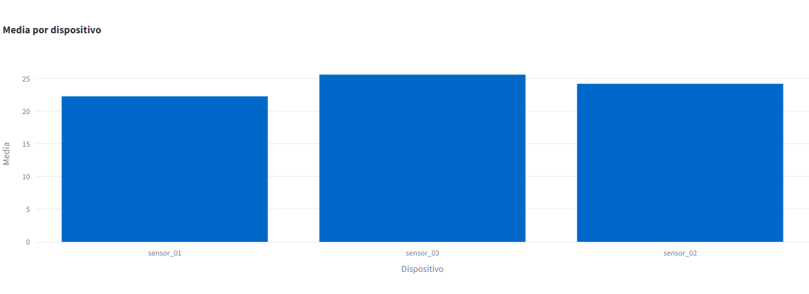
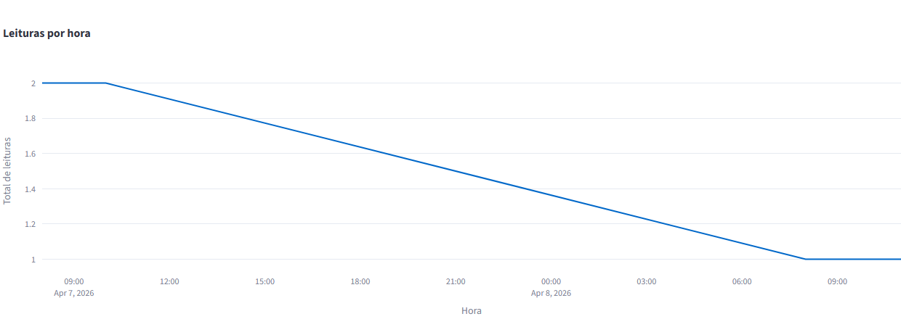
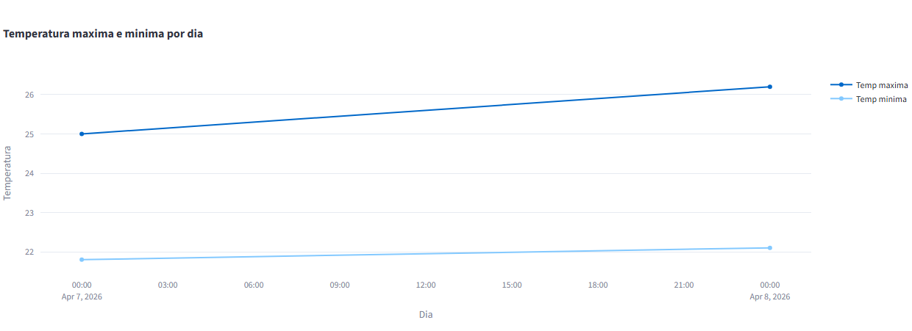

# Pipeline de Dados com IoT e Docker

Pipeline de dados que processa leituras de temperatura de dispositivos IoT, armazena em PostgreSQL e visualiza em dashboard interativo com Streamlit e Plotly.

**Disciplina:** Disruptive Architectures: IoT, Big Data e IA — UniFECAF

---

## Tecnologias Utilizadas

- **Python 3.11** — processamento e ingestão de dados
- **PostgreSQL 15** — armazenamento relacional dos dados
- **Docker / Docker Compose** — container do banco de dados
- **SQLAlchemy + psycopg2** — conexão Python ↔ PostgreSQL
- **Pandas** — leitura e tratamento do CSV
- **Streamlit** — dashboard web interativo
- **Plotly Express** — gráficos interativos

---

## Estrutura de Pastas

```
iot_pipeline_academico/
├── src/
│   ├── main.py          # pipeline de ingestão de dados
│   ├── dashboard.py     # dashboard Streamlit
│   └── views.sql        # 3 views SQL
├── data/
│   └── iot_temperature.csv   # dataset IoT
├── docs/
│   └── dashboard_screenshot.png
├── docker-compose.yml
├── requirements.txt
├── .env.example
└── README.md
```

---

## Como Executar

### 1. Pré-requisitos

- Python 3.11+
- Docker Desktop instalado

### 2. Clonar o repositório

```bash
git clone https://github.com/SEU_USUARIO/iot_pipeline_academico.git
cd iot_pipeline_academico
```

### 3. Criar o ambiente virtual e instalar dependências

```bash
python -m venv .venv
.venv\Scripts\activate        # Windows
pip install -r requirements.txt
```

### 4. Configurar variáveis de ambiente

Copie `.env.example` para `.env`:

```bash
copy .env.example .env
```

### 5. Subir o PostgreSQL com Docker

```bash
docker compose up -d
```

### 6. Executar o pipeline de dados

```bash
python src/main.py
```

### 7. Iniciar o dashboard

```bash
streamlit run src/dashboard.py
```

Acesse: [http://localhost:8501](http://localhost:8501)

---

## Views SQL

O arquivo `src/views.sql` cria 3 views no banco de dados:

### 1. `avg_temp_por_dispositivo`
Calcula a **média de temperatura** de cada sensor IoT.  
**Propósito:** identificar quais dispositivos registram temperaturas mais altas em média, útil para detectar sensores em ambientes mais quentes ou com possível falha de calibração.

```sql
CREATE VIEW avg_temp_por_dispositivo AS
SELECT device_id, AVG(temperature) AS media_temperatura
FROM temperature_readings
GROUP BY device_id;
```

### 2. `leituras_por_hora`
Conta o **total de leituras por hora** do dia.  
**Propósito:** entender o padrão temporal de coleta de dados, identificando horários de pico de transmissão dos sensores.

```sql
CREATE VIEW leituras_por_hora AS
SELECT DATE_TRUNC('hour', timestamp) AS hora, COUNT(*) AS total_leituras
FROM temperature_readings
GROUP BY hora ORDER BY hora;
```

### 3. `temp_max_min_por_dia`
Exibe a **temperatura máxima e mínima por dia**.  
**Propósito:** monitorar a variação diária de temperatura, permitindo identificar dias com oscilação anormal que podem indicar falhas nos equipamentos monitorados.

```sql
CREATE VIEW temp_max_min_por_dia AS
SELECT DATE(timestamp) AS dia, MAX(temperature) AS temp_max, MIN(temperature) AS temp_min
FROM temperature_readings
GROUP BY dia ORDER BY dia;
```

---

## Dashboard

O dashboard exibe 3 gráficos interativos gerados a partir das views SQL do PostgreSQL:

### Gráfico 1 — Média de temperatura por dispositivo


### Gráfico 2 — Leituras por hora


### Gráfico 3 — Temperatura máxima e mínima por dia


---

## Dataset

Dados de leitura de temperatura de sensores IoT.  
Fonte: [Kaggle — Temperature Readings: IoT Devices](https://www.kaggle.com/datasets/atulanandjha/temperature-readings-iot-devices)  
Colunas: `device_id`, `temperature`, `timestamp`

---

## Comandos Git Utilizados

```bash
git init                                          # inicializa repositório
git add .                                         # adiciona todos os arquivos
git commit -m "Projeto inicial: Pipeline IoT"     # cria commit
git remote add origin URL_DO_REPOSITORIO          # conecta ao GitHub
git push -u origin main                           # envia para o GitHub
```

---

## Principais Insights

- **sensor_03** registrou a maior média de temperatura (~25.6°C)
- **sensor_01** registrou a menor média (~22.3°C), indicando ambiente mais frio
- A variação máx/mín diária foi pequena, sugerindo ambiente controlado
- Em produção real, picos de temperatura acima de um limiar poderiam disparar alertas automáticos
